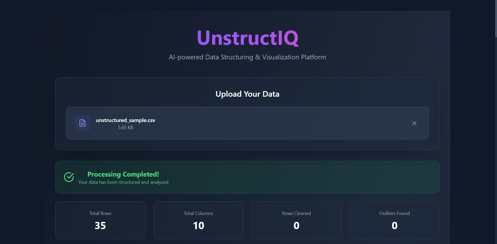
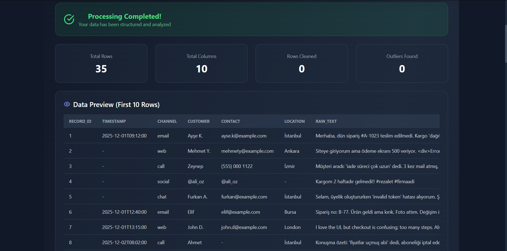
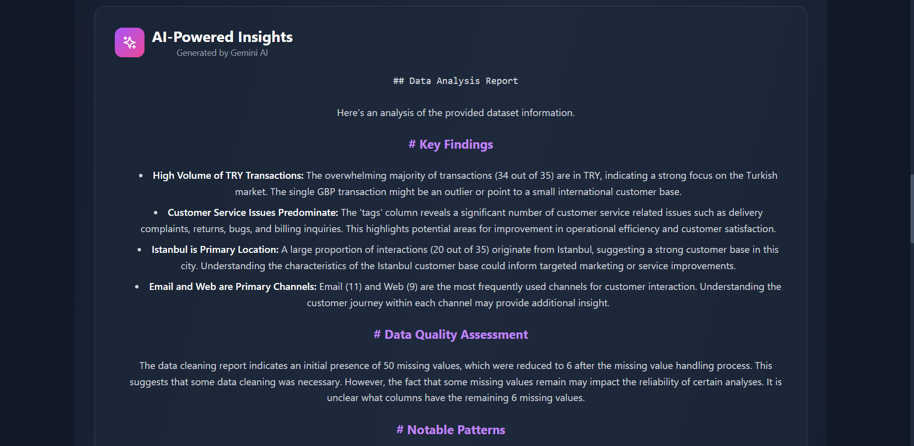
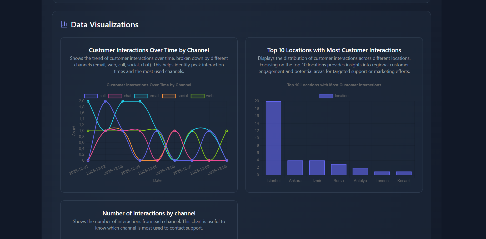

# 🚀 UnstructIQ

**AI-Powered Data Structuring & Visualization Platform**

Transform unstructured data into actionable insights with intelligent automation, advanced analytics, and AI-powered visualizations.

   

---

## ✨ Features

### 🎯 Core Capabilities
- **Multi-Format Support**: CSV, JSON, Excel (xlsx/xls), TXT with automatic encoding detection
- **Intelligent Data Cleaning**: Automatic duplicate removal, missing value handling, column name standardization
- **AI-Powered Chart Generation**: Gemini AI suggests and creates 4 meaningful visualizations
- **Advanced Analytics**: 
  - Trend detection with percentage changes
  - Outlier detection using IQR method
  - Correlation matrix with strong relationship identification
  - Data quality anomaly detection
- **Comprehensive Insights**: AI-generated insights with key findings, patterns, and recommendations
- **Data Preview**: Interactive table showing first 10 rows
- **Export Options**: Download cleaned CSV and full results JSON

### 🤖 AI Integration
- **Gemini 2.0 Flash**: Powers intelligent chart selection and insight generation
- **Smart Chart Types**: Line (time-series), Bar, Pie, Scatter based on data characteristics
- **Context-Aware**: Respects user prompts for focused analysis

### 📊 Analytics Features
- Statistical analysis (mean, median, std, min, max, quartiles)
- Categorical distribution analysis
- Time-series trend analysis
- Multi-dimensional correlation analysis
- Automated outlier detection with configurable thresholds

---

## 🏗️ Tech Stack

### Backend
- **Framework**: FastAPI (Python 3.13)
- **Data Processing**: Pandas, NumPy
- **AI**: Google Gemini AI (gemini-2.0-flash-exp)
- **File Parsing**: openpyxl, PyPDF2
- **Validation**: Pydantic

### Frontend
- **Framework**: React 18 + TypeScript
- **Build Tool**: Vite
- **Styling**: TailwindCSS + Custom Design System
- **Charts**: Chart.js + react-chartjs-2
- **Icons**: Lucide React
- **Markdown**: react-markdown + remark-gfm

---

## 🚀 Quick Start

### Prerequisites
- Python 3.13+
- Node.js 18+
- Gemini API Key ([Get one here](https://aistudio.google.com/app/apikey))

### Option 1: Docker (Recommended)
```bash
# Clone repository
git clone https://github.com/yourusername/UnstructIQ.git
cd UnstructIQ

# Set up environment variables
cp backend/.env.example backend/.env
# Edit backend/.env and add your GEMINI_API_KEY

# Run with Docker Compose
docker-compose up -d

# Access application
# Frontend: http://localhost:5173
# Backend API: http://localhost:8000
# API Docs: http://localhost:8000/docs
```

### Option 2: Local Development

#### Backend Setup
```bash
cd backend

# Create virtual environment
python -m venv venv

# Activate virtual environment
# Windows:
venv\Scripts\activate
# macOS/Linux:
source venv/bin/activate

# Install dependencies
pip install -r requirements.txt

# Set up environment variables
cp .env.example .env
# Edit .env and add your GEMINI_API_KEY

# Run server
uvicorn app.main:app --reload
```

#### Frontend Setup
```bash
cd frontend

# Install dependencies
npm install

# Run development server
npm run dev
```

---

## 📁 Project Structure
```
UnstructIQ/
├── backend/
│   ├── app/
│   │   ├── api/
│   │   │   └── routes.py          # API endpoints
│   │   ├── services/
│   │   │   ├── processing_service.py  # Main orchestration
│   │   │   ├── chart_service.py       # AI chart generation
│   │   │   ├── llm_service.py         # Gemini AI integration
│   │   │   └── analytics_service.py   # Advanced analytics
│   │   ├── utils/
│   │   │   ├── file_parser.py         # Multi-format parsing
│   │   │   ├── data_cleaner.py        # Data cleaning logic
│   │   │   └── file_handler.py        # File management
│   │   ├── config.py              # Configuration
│   │   ├── schemas.py             # Pydantic models
│   │   └── main.py                # FastAPI application
│   ├── uploads/                   # Temporary file storage
│   ├── processed/                 # Processing results
│   ├── requirements.txt
│   ├── Dockerfile
│   └── .env.example
├── frontend/
│   ├── src/
│   │   ├── components/
│   │   │   └── ChartDisplay.tsx   # Chart rendering
│   │   ├── services/
│   │   │   └── api.js             # API client
│   │   ├── App.tsx                # Main application
│   │   └── main.tsx               # Entry point
│   ├── public/
│   ├── package.json
│   ├── Dockerfile
│   ├── vite.config.ts
│   └── tailwind.config.js
├── docker-compose.yml
└── README.md
```

---

## 🔧 Configuration

### Backend Environment Variables

Create `backend/.env`:
```env
# Gemini AI
GEMINI_API_KEY=your_gemini_api_key_here

# Server
HOST=0.0.0.0
PORT=8000

# Storage
UPLOAD_DIR=./uploads
PROCESSED_DIR=./processed
MAX_FILE_SIZE=52428800  # 50MB

# CORS
ALLOWED_ORIGINS=http://localhost:5173,http://localhost:3000
```

### Frontend Configuration

Update `frontend/src/services/api.js` if needed:
```javascript
const API_BASE_URL = 'http://localhost:8000';
```

---

## 📖 Usage

### 1. Upload File
- Drag & drop or click to browse
- Supported formats: CSV, JSON, Excel, TXT
- Optional: Add processing instructions

### 2. Process Data
- Click "Process Data" button
- Watch real-time processing stages:
  - Parsing file
  - Cleaning data
  - Analyzing statistics
  - Detecting patterns
  - Generating visualizations
  - AI analyzing patterns

### 3. View Results
- **Data Summary**: Total rows, columns, cleaned rows, outliers
- **Data Preview**: First 10 rows in interactive table
- **Export Options**: Download cleaned CSV or full JSON
- **Data Quality Issues**: Duplicates, single-value columns, high null columns
- **Detected Trends**: Percentage changes in numeric columns
- **AI Insights**: Key findings, data quality, patterns, recommendations
- **Visualizations**: 4 AI-generated charts
- **Advanced Analytics**: Outliers, correlations, anomalies
- **Statistical Analysis**: Detailed numeric and categorical stats

---

## 🎨 Example Use Cases

### Business Analytics
```
Upload: sales_data.csv
Prompt: "Focus on revenue trends and regional performance"
Output: Revenue time-series, regional distribution, product performance
```

### Customer Support
```
Upload: support_tickets.csv
Prompt: "Analyze ticket volumes and common issues"
Output: Channel distribution, location analysis, tag frequency
```

### Research Data
```
Upload: experiment_results.xlsx
Prompt: "Identify significant correlations and outliers"
Output: Correlation matrix, outlier detection, statistical summaries
```

---

## 🔗 API Endpoints

### Health Check
```http
GET /health
```

### Upload File
```http
POST /api/upload
Content-Type: multipart/form-data

Body:
- file: File
- prompt: String (optional)
```

### Process File
```http
POST /api/process/{job_id}
```

### Get Results
```http
GET /api/results/{job_id}
```

### Export CSV
```http
GET /api/export/csv/{job_id}
```

### Export JSON
```http
GET /api/export/json/{job_id}
```

Full API documentation: http://localhost:8000/docs

---

## 🐳 Docker Deployment

### Build and Run
```bash
# Build images
docker-compose build

# Start services
docker-compose up -d

# View logs
docker-compose logs -f

# Stop services
docker-compose down
```

### Production Deployment
```bash
# Use production configuration
docker-compose -f docker-compose.prod.yml up -d
```

---

## 🧪 Development

### Backend Testing
```bash
cd backend
pytest
```

### Frontend Development
```bash
cd frontend
npm run dev    # Development server
npm run build  # Production build
npm run preview  # Preview production build
```

### Code Quality
```bash
# Backend
black app/
flake8 app/

# Frontend
npm run lint
npm run type-check
```

---

## 🤝 Contributing

Contributions are welcome! Please follow these steps:

1. Fork the repository
2. Create a feature branch (`git checkout -b feature/AmazingFeature`)
3. Commit your changes (`git commit -m 'Add some AmazingFeature'`)
4. Push to the branch (`git push origin feature/AmazingFeature`)
5. Open a Pull Request

---

## 📝 License

This project is licensed under the MIT License - see the [LICENSE](LICENSE) file for details.

---

## 👨‍💻 Author

**Furkan Aksoy**
- GitHub: [@FurkanAksoyy](https://github.com/FurkanAksoyy)
- LinkedIn: [Furkan Aksoy](https://www.linkedin.com/in/furkan-aksoy-07a256280/)

---

## 🙏 Acknowledgments

- [FastAPI](https://fastapi.tiangolo.com/) - Modern Python web framework
- [React](https://react.dev/) - UI library
- [Google Gemini AI](https://ai.google.dev/) - AI-powered insights
- [Chart.js](https://www.chartjs.org/) - Flexible charting library
- [TailwindCSS](https://tailwindcss.com/) - Utility-first CSS framework

---

## 📸 Screenshots

### Upload Interface


### Data Preview


### AI Insights


### Visualizations


---

## 🗺️ Roadmap

- [ ] Multi-language support (Turkish, English)
- [ ] Real-time collaboration
- [ ] Database integration (PostgreSQL)
- [ ] Job queue with Celery
- [ ] User authentication & authorization
- [ ] Scheduled processing
- [ ] Custom chart templates
- [ ] Interactive data filtering
- [ ] PDF report generation
- [ ] API rate limiting
- [ ] Webhook notifications

---

## 💬 Support

For support, email furkanaksoy178@gmail.com or open an issue on GitHub.

---

<p align="center">Made with ❤️ by Furkan Aksoy</p>